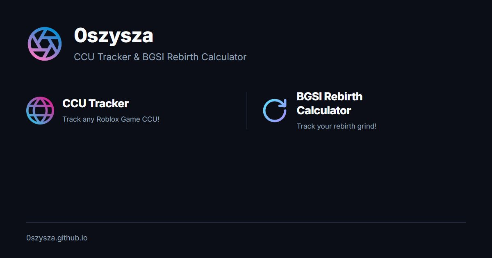

# 0szysza · Tool hub

A minimal home for two Roblox tools.

**[Open the hub](https://0szysza.github.io/)**

## Choose a tool

| Tool | What you can do |
| --- | --- |
| [CCU Tracker](https://0szysza.github.io/trackccu/) | Explore live Roblox players, game/group history, peaks, game extras and comparisons. [Feature guide](https://github.com/0szysza/trackccu#features). |
| [BGSI Rebirth Calculator](https://0szysza.github.io/rebirth/) | Track up to three named accounts, set a custom rebirth pace, save starting counts and estimate finish times. [Feature guide](https://github.com/0szysza/rebirth#features). |

## Features

- Two centered choices using each tool’s own logo and matching typography.
- A small hover scale on desktop and a touch-friendly stacked layout on phones.
- Discord and X profile links below the tool choices.
- The smooth gradient shutter logo as the browser favicon and Apple touch icon.
- Keyboard focus styling and reduced-motion support.
- A branded Discord/social link preview with a title, description and 1200 × 630 PNG cover.
- A static page that needs no sign-in, package installation or application backend.

## Development

Serve the repository over HTTP:

~~~sh
python -m http.server 8000
~~~

Open [localhost:8000](http://localhost:8000/). The page’s CSS is contained in `index.html`. Tool logos are loaded from the corresponding published websites.

| Path | Purpose |
| --- | --- |
| `index.html` | Layout, tool links, social links and Open Graph/Twitter metadata. |
| `favicon.png` | Supplied smooth shutter logo, used for favicon and Apple touch icon. |
| `assets/social/cover.png` | Published share-card image. |
| `assets/social/card.html` | Editable source for the share-card artwork. |
| `.github/workflows/` | Existing GitHub Pages publication workflow. |

## Publishing and previews

The `0szysza.github.io` repository hosts the root site at [0szysza.github.io](https://0szysza.github.io/); the two tools are maintained in their own repositories.

Push changes to `main` to run the existing Pages workflow. Sharing metadata is included in the initial HTML, so crawlers can read it without JavaScript. The cover image URL is absolute HTTPS, and the favicon has its own version to refresh it after a replacement.

To update the social artwork, edit `assets/social/card.html`, capture it at 1200 × 630, replace `cover.png` and update its metadata version. Platforms can retain cached previews of previously shared links.

## Project links

- [CCU Tracker repository](https://github.com/0szysza/trackccu)
- [BGSI Rebirth Calculator repository](https://github.com/0szysza/rebirth)
- [0szysza on GitHub](https://github.com/0szysza)
- [0szysza on X](https://x.com/0szysza)
